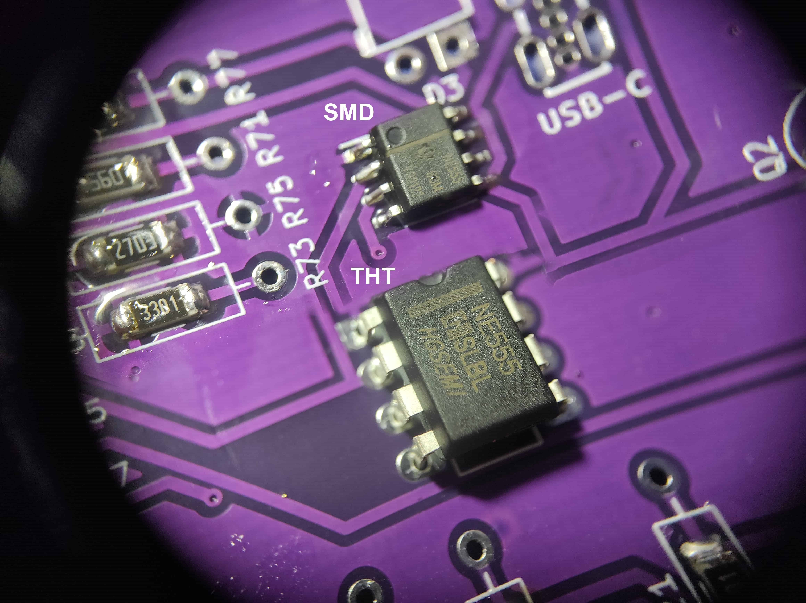

V tomto dokumentu je uveden návod na zapájení elektronického piána Tone-O-Mat. Seznam dílů naleznete v souboru Tone-O-Mat_BOM.csv.

___
# Obsah
* [Přichystání desky](#prep)
* [Osazení rezistorů](#rezistors)
* [Osazení kondenzátorů](#capacitors)
* [Osazení 555 timeru](#555timer)
* [Osazení diod](#diodes)
* [Osazení tranzistorů](#transistors)
* [Osazení LED diody](#led)
* [Osazení USB-C konektoru](#usb)
* [Osazení elektrolytického kondenzátoru](#electrolyticCapacitor)
* [Osazení vypínače](#switch)
* [Osazení potenciometrů](#potentiometers)
* [Osazení reproduktoru](#speaker)
* [Stylus](#stylus)
___

## <a name = prep>Přichystání desky</a>
**Potřebné díly:**
* Deska plošných spojů

**Nástroje:**
* Papírová nebo jiná maskovací páska
    

**Postup:**
1. Přelepte klávesnici páskou, aby se na ni při pájení nedostal cín.
    

## <a name = rezistors>Osazení rezistorů</a>
**Potřebné díly:**
* Deska plošných spojů
* Všechny hodnoty rezistorů v tabulce 1

**Postup:**
1. Nyní je třeba se rozhodnout, jestli chcete osazovat THT nebo SMD součástky (s nožičkami nebo bez, v tomto pořadí). Na obrázku vidíte, jak správně osadit THT nebo SMD rezistor.
    
2. Přichystejte si THT nebo SMD rezistory.
3. Postupně osaďte desku odpovídajícími hodnotami rezistorů, které najdete v tabulce 1.
    

## <a name = capacitors>Osazení kondenzátorů</a>
**Potřebné díly:**
* Deska plošných spojů
* Všechny hodnoty kondenzátorů v tabulce 2

**Postup:**
1. Na obrázku vidíte, jak správně osadit THT nebo SMD kondenzátor.
    
2. Postupně osaďte všechny kondenzátory v SMD nebo THT variantě.
    

## <a name = 555timer>Osazení 555 timeru</a>
**Potřebné díly:**
* Deska plošných spojů
* timer NE555 v THT nebo SMD variantě

**Postup:**
1. Osaďte 555 timer na desku. Nezapomeňte na polaritu součástky!
    

## <a name = diodes>Osazení diod</a>
**Potřebné díly:**
* Deska plošných spojů
* 2x dioda 1N4148

**Postup:**
1. Osaďte obě diody. Nezapomeňte na polaritu součástky a fakt, že každá dioda směřuje jiným směrem!
    

## <a name = transistors>Osazení tranzistorů</a>
**Potřebné díly:**
* Deska plošných spojů
* 2x tranzistor BC547

**Postup:**
1. Osaďte oba tranzistory. Nezapomeňte na polaritu součástky a fakt, že každý tranzistor směřuje jiným směrem!
    

## <a name = led>Osazení LED diody</a>
**Potřebné díly:**
* Deska plošných spojů
* 1x zelená LED

**Postup:**
1. Osaďte zelenou LED. Nezapomeňte na polaritu součástky (+ je vyznačeno na desce (až od verze 1.6) a je to ta delší nožička LEDky)!
    

## <a name = usb>Osazení USB-C konektoru</a>
**Potřebné díly:**
* Deska plošných spojů
* 1x USB-C konektor

**Postup:**
1. Osaďte USB-C konektor. Dbejte na malé množství cínu, piny nesmí být slité dohromady!
    
    

## <a name = electrolyticCapacitor>Osazení elektrolytického kondenzátoru</a>
**Potřebné díly:**
* Deska plošných spojů
* 1x elektrolytický kondenzátor 100uF

**Postup:**
1. Osaďte elektrolytický kondenzátor. Nezapomeňte, že narozdíl od keramických kondenzátorů osazovaných předtím má tento kondenzátor polaritu (kratší nožička je -, je to vyznačeno i na obalu kondenzátoru)!
    

## <a name = switch>Osazení vypínače</a>
**Potřebné díly:**
* Deska plošných spojů
* 1x vypínač

**Postup:**
1. Osaďte vypínač. Polaritu nemá.
    

## <a name = potentiometers>Osazení potenciometrů</a>
**Potřebné díly:**
* Deska plošných spojů
* 2x potenciometr

**Postup:**
1. Osaďte potenciometry. Nemusíte jejich dvě větší nožičky nějak zásadně obalovat cínem, stačí malé množství.
    

## <a name = speaker>Osazení reproduktoru</a>
**Potřebné díly:**
* Deska plošných spojů
* Reproduktor
* Cívka tenkého kabelu

**Postup:**
1. Ustřihněte dva cca 4-5 cm dlouhé kousky kabelu a odizolujte konce. Tyto konce následně pocínujte.
    
2. Oba kabely připajte k reproduktoru (každý kabel k jednomu pinu).
3. Oba kabely připájejte do desky (i když je zde vyznačeno +, reproduktor jako takový polaritu nemá).
    
4. Reproduktor přilepte tavnou pistolí k desce na označené místo.
    

## <a name = stylus>Stylus</a>
**Potřebné díly:**
* Deska plošných spojů
* Cícka kabelu

**Postup:**
1. 