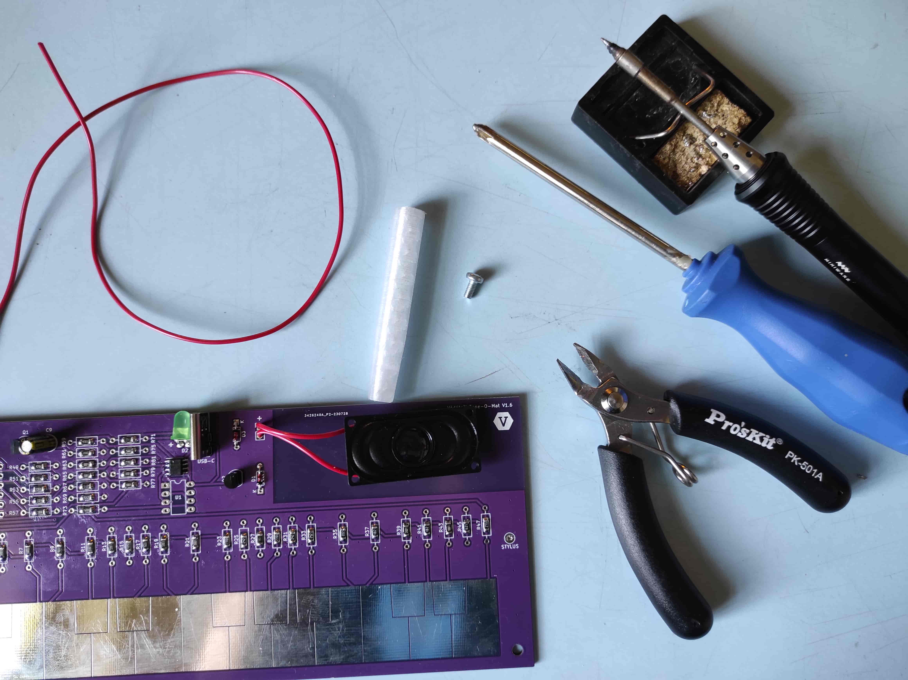
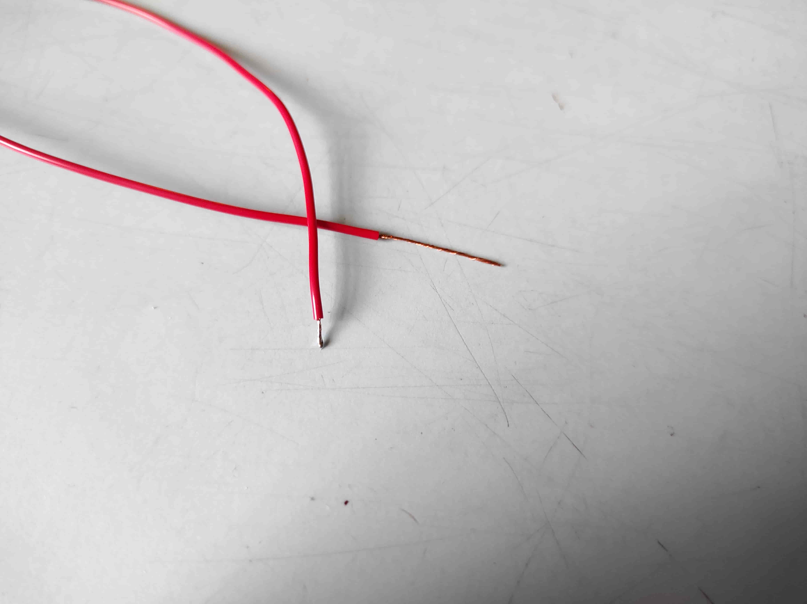
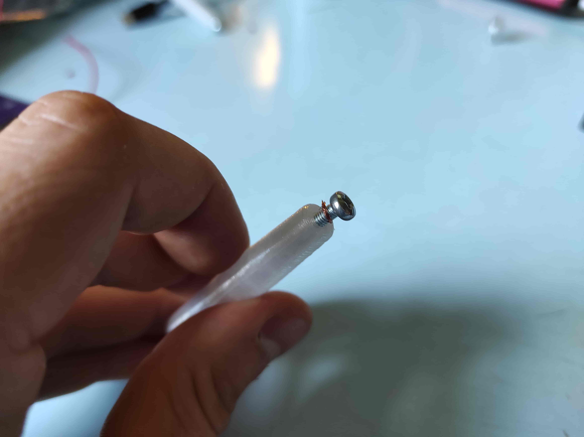
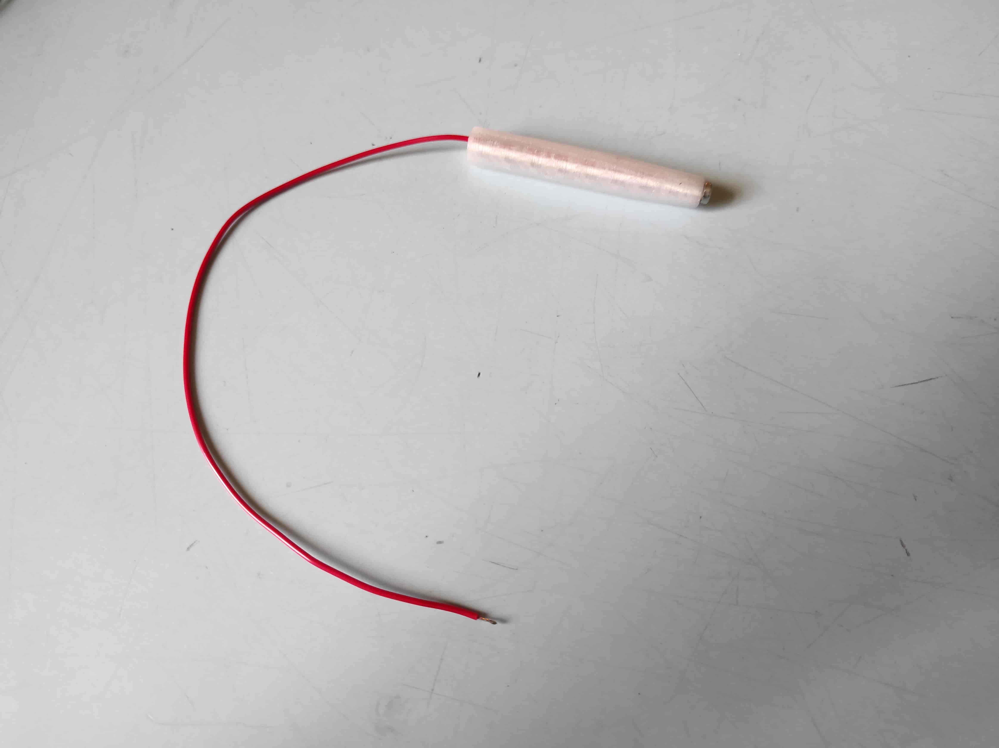
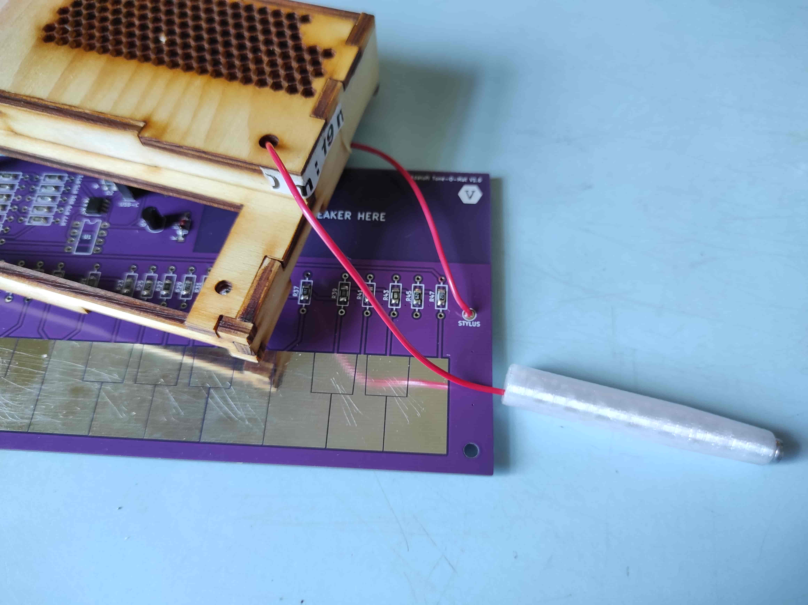
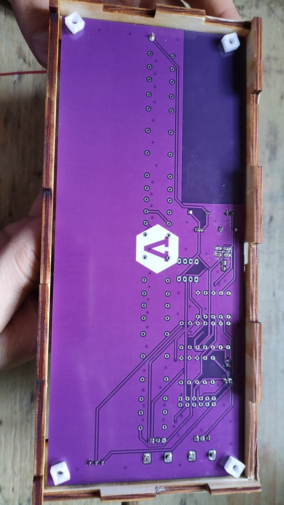
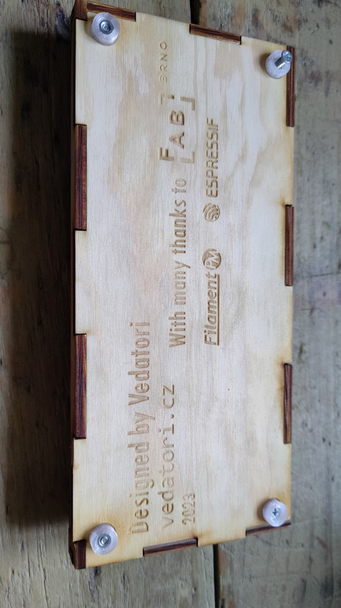
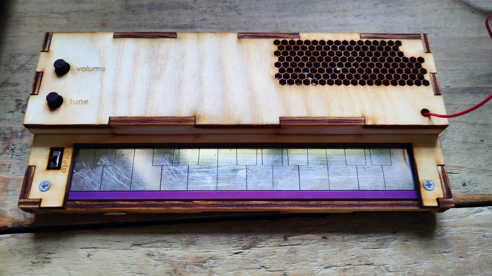
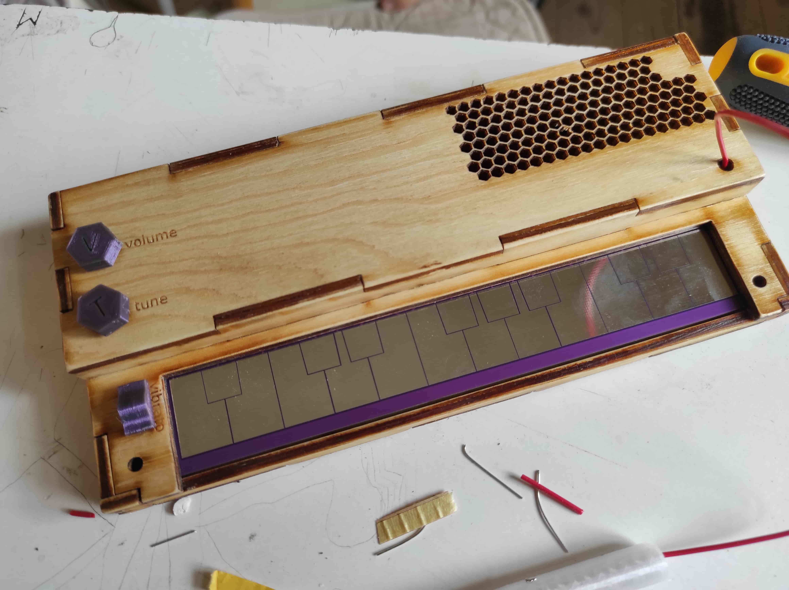

V tomto dokumentu je uveden návod na zapájení elektronického piána Tone-O-Mat.
Pro tento návod si zavedeme následující pojmy:
* DPS (Deska Plošných Spojů) - Laminátová deska pokrytá elektricky vodivými měděnými cestami, na kterou budeme nyní pájet součástky.
* SMD (Surface Mount Device) - Tzv. bezvývodové elektronické součástky, které mají krátké nožičky. Tyto součástky jsou připájeny k DPS pouze z jedné strany. Tyto součástky byly osazevy strojově při výrobě DPS.
* THT (Through-hole Technology) - Tzv. vývodové elekotronické součástky, které mají dlouhé nožičky. Tyto nožičky jsou před zapájením součástky prostrčeny skrz otvory v DPS.

___
# Obsah
* [Přichystání desky](#prep)
* [Osazení rezistorů](#rezistors)
* [Osazení keramických kondenzátorů](#capacitors)
* [Osazení 555 timeru](#555timer)
* [Osazení diod](#diodes)
* [Osazení tranzistorů](#transistors)
* [Osazení LED diody](#led)
* [Osazení USB-C konektoru](#usb)
* [Osazení elektrolytického kondenzátoru](#electrolyticCapacitor)
* [Osazení vypínače](#switch)
* [Osazení potenciometrů](#potentiometers)
* [Osazení reproduktoru](#speaker)
* [Stylus](#stylus)
___

<!-- _________________________________________________________________ -->
# <a name = prep>Přichystání desky</a>
## Potřebujeme:
* Desku plošných spojů
* Papírovou nebo jinou maskovací pásku

## Postup:
Přelepte klávesnici páskou, aby se na ni při pájení nedostal cín.

# <a name = rezistors>Osazení rezistorů</a>
## Potřebujeme:
* Desku plošných spojů
* Všechny hodnoty rezistorů v tabulce níže

<!-------------- Table 1 ------------>
| Číslo rezistoru | Hodnota |
|-----------------:|:---------:|
| R11, R13, R19, R53, R55, R79 | 3k3 |
| R1, R5, R49, R59, R73 | 4k7 |
| R43, R63, R77 | 1k |
| R25, R31, R33 | 2k4 |
| R27, R51, R71 | 150R |
| R3, R61 | 300R |
| R9, R17 | 3k6 |
| R23, R29 | 2k7 |
| R37, R41 | 1k8 |
| R67, R69 | 5k1 |
| R7 | 4k3 |
| R15 | 500R |
| R21 | 3k |
| R35 | 2k2 |
| R39 | 2k |
| R45 | 620R |
| R47 | 27k |
| R57 | 10k |
| R65 | 680R |
| R75 | 56R |
| R81 | 270k |
<!-------------------------->

## Postup:
Nyní je třeba se rozhodnout, jestli chcete osazovat THT nebo SMD součástky. Na obrázku vidíte, jak správně osadit THT nebo SMD rezistor.
    
Přichystejte si THT nebo SMD rezistory.
Postupně osaďte desku odpovídajícími hodnotami rezistorů, které najdete v tabulce nahoře.

# <a name = capacitors>Osazení keramických kondenzátorů</a>
## Potřebujeme:
* Desku plošných spojů
* Všechny hodnoty keramických kondenzátorů v tabulce níže

| Kondenzátor | Hodnota |
|-----------------:|:---------:|
| C1, C3, C5 | 100nF |
| C7 | 10uF |
| C11 | 2.2uF |
| C13 | 27nF |

## Postup:
Na obrázku vidíte, jak správně osadit THT nebo SMD kondenzátor.

Postupně osaďte všechny kondenzátory v SMD nebo THT variantě.

# <a name = 555timer>Osazení 555 timeru</a>
## Potřebujeme:
* Desku plošných spojů
* timer NE555 v THT nebo SMD variantě

## Postup:
Osaďte 555 timer na desku. Nezapomeňte na polaritu součástky!

# <a name = diodes>Osazení diod</a>
## Potřebujeme:
* Desku plošných spojů
* 2x dioda 1N4148

## Postup:
Osaďte obě diody. Nezapomeňte na polaritu součástky a fakt, že každá dioda směřuje jiným směrem!

# <a name = transistors>Osazení tranzistorů</a>
## Potřebujeme:
* Desku plošných spojů
* 2x tranzistor BC547

## Postup:
Osaďte oba tranzistory. Nezapomeňte na polaritu součástky a fakt, že každý tranzistor směřuje jiným směrem!

# <a name = led>Osazení LED diody</a>
## Potřebujeme:
* Desku plošných spojů
* 1x zelená LED

## Postup:
Osaďte zelenou LED. Nezapomeňte na polaritu součástky (+ je vyznačeno na desce (až od verze 1.6) a je to ta delší nožička LEDky)!

# <a name = usb>Osazení USB-C konektoru</a>
## Potřebujeme:
* Desku plošných spojů
* 1x USB-C konektor

## Postup:
Osaďte USB-C konektor. Dbejte na malé množství cínu, piny nesmí být slité dohromady!

# <a name = electrolyticCapacitor>Osazení elektrolytického kondenzátoru</a>
## Potřebujeme:
* Desku plošných spojů
* 1x elektrolytický kondenzátor 100uF

## Postup:
Osaďte elektrolytický kondenzátor. Nezapomeňte, že narozdíl od keramických kondenzátorů osazovaných předtím má tento kondenzátor polaritu (kratší nožička je -, je to vyznačeno i na obalu kondenzátoru)!

# <a name = switch>Osazení vypínače</a>
## Potřebujeme:
* Desku plošných spojů
* 1x vypínač

## Postup:
Osaďte vypínač. Polaritu nemá.

# <a name = potentiometers>Osazení potenciometrů</a>
## Potřebujeme:
* Desku plošných spojů
* 2x potenciometr

## Postup:
Osaďte potenciometry. Nemusíte jejich dvě větší nožičky nějak zásadně obalovat cínem, stačí malé množství.

# <a name = speaker>Osazení reproduktoru</a>
## Potřebujeme:
* Desku plošných spojů
* Reproduktor
* Cívka tenkého kabelu

## Postup:
Ustřihněte dva cca 4-5 cm dlouhé kousky kabelu a odizolujte konce. Tyto konce následně pocínujte.

Oba kabely připajte k reproduktoru (každý kabel k jednomu pinu).
Oba kabely připájejte do desky (i když je zde vyznačeno +, reproduktor jako takový polaritu nemá).

Reproduktor přilepte tavnou pistolí k desce na označené místo.

# <a name = stylus>Stylus</a>
## Potřebujeme:
* Desku plošných spojů
* Kabel
* 1x Šroub M3x6
* Tělo stylusu
* Štípací kleště
* Pravítko
* Šroubovák

## Postup:
Ustřihněte cca 35 cm dlouhý kabel a odizolujte z jedné strany 3 mm, z druhé 2 cm. Kratší odizolovaný konec pocínujte.

Delší odizolovaný konec vložte do stylusu a proveďte ho až na doraz. Poté vložte M3 šroub a omotejte kolem něho odizolovaný konec.

Šroub zašroubujte až na doraz tak, aby kolem něho byl omotaný odizolovaný konec drátu.

Hotový stylus proveďte prvně otvorem v krabičce, poté příslušnou ploškou v desce a zapájejte.

# <a name = stylus>Kompletace</a>
## Potřebujeme:
* Spodní díl krabičky
* Vrchní část krabičky
* Osazené PCB
* 4x Šroub M3x16
* Šroubovák

## Postup:
Vložte desku do krabičky a na díry pro šrouby položte plastové spacery.

Opatrně zavřete krabičku a položte do vygravírovaných míst nožičky (nožičky s matkou patří k přední hraně desky). 
Zašroubujte zespodu krabičku pomocí dvou šroubů M3x16.

Zašroubujte krabičku zvrchu pomocí dvou šroubů M3x16.

Nasaďte 3D tištěné díly na potenciometry a přepínač.

