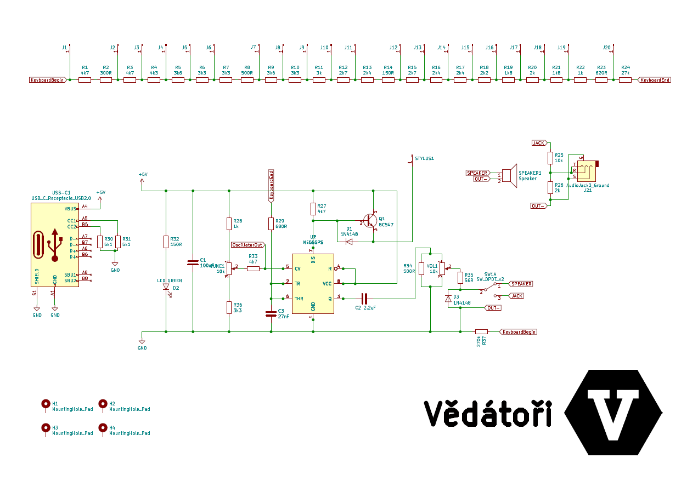

# Tone-O-Mat V2.0 [cz]
Tone-O-Mat je analogový syntetizátor vytvořený pro Letní robotický tábor 2023 organizovaný spolkem Vědátoři. Jedná se o stavebnici založenou na 555 timeru určenou pro vzdělávání v oblasti STEM s reproduktorem nebo výstupem pro audio-jack. Stavebnice se skládá ze dvou hlavních částí - plošného spoje osazeného elektronickými součástkami a dřevěné krabičky. Tuto stavebnici účastníci tábora obdrželi k montáži. Hlavním cílem bylo zdokonalit dovednosti pájení a zručnost v práci se dřevem. Z připravených dřevěných dílů si účastníci sami sestavili a slepili krabičku. Poté se pustili do pájení všech součástek na plošný spoj. Měli možnost volit mezi tradičním pájením THT a náročnějším zapájením SMD součástek. Tento projekt byl koncipován tak, aby byl přístupný jak úplným začátečníkům v pájení, tak i těm s více zkušenostmi. Po dokončení stavebnice mohli účastníci na syntetizátoru hrát jako na malém klavírku.

# Tone-O-Mat V2.0 [en]
Tone-O-Mat is an analog tone synthesizer designed for Summer robotics camp 2023 (cz) organized by Vědátoři team (cz). It is an electronic kit based on a 555 timer meant for STEM education, with speaker or audio-jack output. It is composed of two main parts - a printed circuit board with electronic components and a wooden enclosure. Participants at the camp received this kit for assembly. The primary objective was to enhance soldering skills and proficiency in working with wood. From the pre-cut wooden pieces, participants assembled and glued the enclosure themselves. They then proceeded to solder all the components onto the printed circuit board. They had the option to choose between traditional THT soldering and the more challenging SMD soldering. This project was designed to be accessible to both complete beginners in soldering and those with more experience. Upon completing the assembly, participants could play the synthesizer as a miniature keyboard.

## Licence
* Obsah tohoto repozitáře je sdílen pod licencí [Attribution-NonCommercial-ShareAlike 4.0 International (CC BY-NC-SA 4.0)](https://creativecommons.org/licenses/by-nc-sa/4.0/).

## License
* The contents of this repository are shared under the license [Attribution-NonCommercial-ShareAlike 4.0 International (CC BY-NC-SA 4.0)](https://creativecommons.org/licenses/by-nc-sa/4.0/).

## Source
The schematic was customised from the schematic found at https://gr33nonline.wordpress.com/2018/04/25/stylophone/
